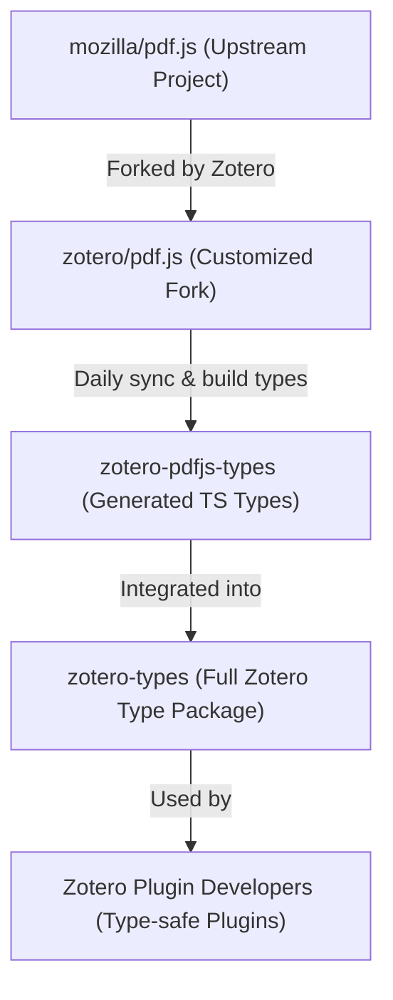

# 📄 zotero-pdfjs-types

[](https://github.com/zotero-plugin-dev/zotero-pdfjs-types/actions/workflows/update-types.yml)
[](https://github.com/zotero-plugin-dev/zotero-pdfjs-types)
[](https://github.com/zotero/pdf.js)

[](https://github.com/windingwind/zotero-types)

**Type definitions for Zotero’s fork of PDF.js**, generated automatically from the latest Zotero [`pdf.js`](https://github.com/zotero/pdf.js) source.

This repository provides up-to-date TypeScript types for plugin developers targeting the Zotero PDF reader environment.

## 🧩 Background

Zotero maintains its own fork of [`pdf.js`](https://github.com/mozilla/pdf.js), with custom modifications for its built-in PDF reader.

Since this fork diverges from upstream, the standard `pdfjs-dist` package no longer reflects Zotero’s implementation.

To enable **TypeScript development** for Zotero plugins interacting with the internal PDF viewer, this project:

- Pulls the **latest Zotero `pdf.js` source** every day
- **Builds it** using the official Gulp pipeline (`npx gulp dist`)
- **Extracts and commits the generated type definitions** to this repository

## 📦 Usage

> [!TIP]
> The `zotero-types` package automatically includes this repository, so you typically **don’t need to install this directly**.

```bash
pnpm add -D zotero-types
```

If you want to use it independently:

```bash
pnpm add -D github:zotero-plugin-dev/zotero-pdfjs-types#main
```

## 🧭 Relationship to Other Projects

- **[`zotero/pdf.js`](https://github.com/zotero/pdf.js)** — the official Zotero fork of Mozilla PDF.js
- **[`zotero-types`](https://github.com/windingwind/zotero-types)** — the comprehensive Zotero TypeScript type package that integrates this repository



## 🧑‍💻 For Contributors

> [!NOTE]
> Do not manually edit files under `types/`. They are automatically generated and will be overwritten.

## 🪪 License

Apache 2.0 License.
